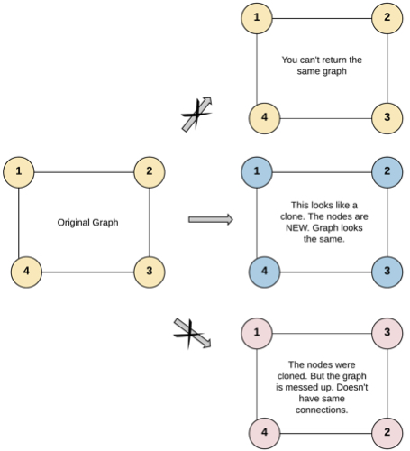
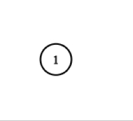

# Description of problem

Given a reference of a node in a <b>connected</b> undirected graph.<br>
Return a <b>deep copy</b> (clone) of the graph.<br>

Each node in the graph contains a value (int) and a list (List[Node]) of its neighbors.<br>

```
class Node {
    public int val;
    public List<Node> neighbors;
}
```

### Test case format:

For simplicity, each node's value is the same as the node's index (1-indexed).<br>
For example, the first node with val == 1, the second node with val == 2, and <br>
so on. The graph is represented in the test case using an adjacency list.

<b>An adjacency list</b> is a collection of unordered lists used to represent a<br> finite graph. Each list describes the set of neighbors of a node in the graph.

The given node will always be the first node with val = 1. You must return the <br>
copy of the given node as a reference to the cloned graph.

### Example 1:



> <b>Input:</b> adjList = [[2,4],[1,3],[2,4],[1,3]]<br> 
<b>Output:</b> [[2,4],[1,3],[2,4],[1,3]]<br> 
<b>Explanation:</b> 
There are 4 nodes in the graph.<br>
1st node (val = 1)'s neighbors are 2nd node (val = 2) and 4th node (val = 4).<br>
2nd node (val = 2)'s neighbors are 1st node (val = 1) and 3rd node (val = 3).<br>
3rd node (val = 3)'s neighbors are 2nd node (val = 2) and 4th node (val = 4).<br>
4th node (val = 4)'s neighbors are 1st node (val = 1) and 3rd node (val = 3).

### Example 2:



> <b>Input:</b> adjList = [[]]<br>
<b>Output:</b> [[]]<br>
<b>Explanation:</b> Note that the input contains one empty list. The graph <br>
consists of only one node with val = 1 and it does not have any neighbors.

### Example 3:

> <b>Input:</b> adjList = []<br>
<b>Output:</b> []<br>
<b>Explanation:</b> This an empty graph, it does not have any nodes.

### Constraints:

- The number of nodes in the graph is in the range [0, 100].
- 1 <= Node.val <= 100
- Node.val is unique for each node.
- There are no repeated edges and no self-loops in the graph.
- The Graph is connected and all nodes can be visited starting from the <br>
  given node.

### Difficulty: medium

# Description of solution

### Approach

For cloning, use a recursive depth-first search (DFS) algorithm.

1. Call the DFS algorithm for each unvisited vertex.
2. To save information about visited peaks, use a map.

When visiting the peak you must:

- get a copy of the vertex from the map - if it is there, otherwise clone the <br>
  vertex but without the list of neighbors of the original;
- add a clone of the neighboring vertex from which the algorithm for the <br>
  current vertex was called;
- if the vertex has not yet been visited (not in the map), then call the DFS <br>
  algorithm for all its neighbors.

### Complexity:

- Time complexity: O(n + m):<br>
  n - number of edges,<br>
  m - number of vertices;

- Space complexity: O(n).
